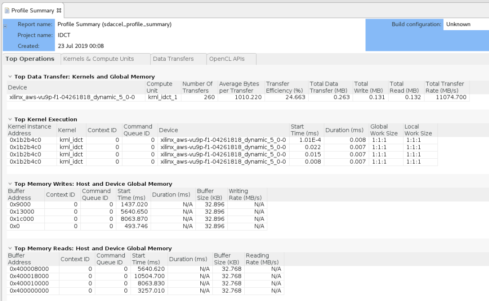
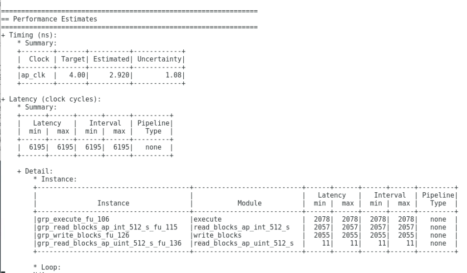
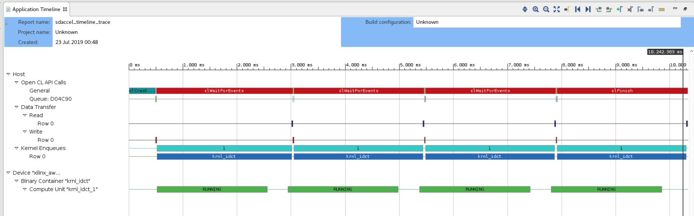
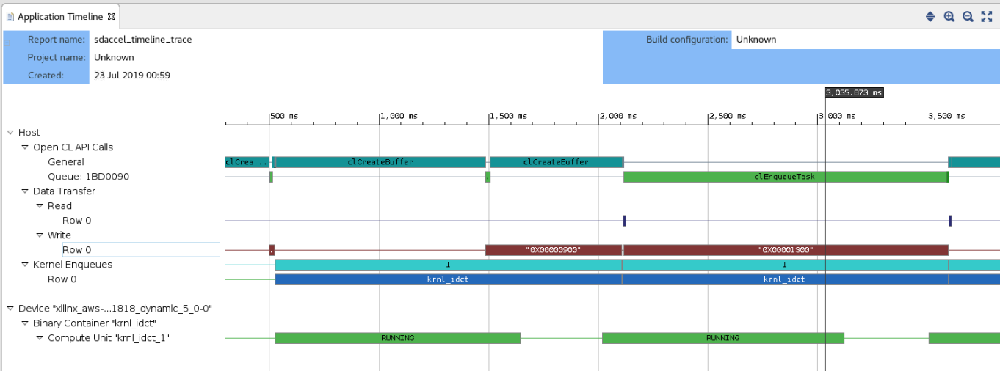

<table style="width:100%">
  <tr>
    <th width="100%" colspan="5"><h2>AWS F1 Xilinx Developer Labs</h2></th>
  </tr>
  <tr>
    <td width="20%" align="center"><a href="README.md">Introduction</a></td>
    <td width="20%" align="center"><a href="SETUP.md">1. Connecting to your F1 instance</a></td>
    <td width="20%" align="center"><a href="FFMPEG_Lab.md">2. Experiencing F1 acceleration</a></td>
    <td width="20%" align="center"><b>3. Developing F1 applications</b></td>
    <td width="20%" align="center"><a href="WRAP_UP.md">4. Wrapping-up</td>
  </tr>
</table>

---------------------------------------

### Developing, profiling and optimizing F1 applications with SDAccel

This tutorial is designed to teach the fundamentals of the SDAccel development environment and programming model. This includes: familiarizing with OpenCL, understanding software and hardware emulation flows, profiling performance and identifying how to optimize host and kernel code.

The kernel used in this tutorial is an Inverse Discrete Cosine Transform (IDCT), a function widely used in audio/image codecs such as HEVC.

To simplify this tutorial, a workspace preloaded with the initial project configuration is provided in the lab repository.

Please also note that although the entire tutorial is performed on an F1 instance, only the final step of this tutorial really needs to be run on F1. All the interactive development, profiling and optimization steps would normally be performed on-premise or on a cost-effective AWS EC2 instance such as C4. However, to avoid switching from C4 to F1 instances during this tutorial, all the steps are performed on the F1 instance.

### Starting SDAccel

1.  Open a new terminal by right-clicking anywhere in the Desktop area and selecting **Open Terminal**.

1.  Source the SDAccel environment  

    ```bash
    cd ~/src/project_data/aws-fpga
    source sdaccel_setup.sh
    ```
	*Note: the sdaccel_setup.sh script might generate warning messages, but these can be safely ignored.*


1. Go to design folder and investigate the files.
    ```bash
    cd ~/AWS-F1-Developer-Labs/idct/design
    ls
    ```
    This command listed the files and directory under `design`. The `src` folder contains the kernel source file and host code. The `Makefile` is provided for design compilation and execution. Let's open up the make file and take a look at its contents.
    ```
    vi Makefile
    ```
    In 'platform selection' section, the default target platform is set as `xilinx_aws-vu9p-f1-04261818_dynamic_5_0` which is the AWS F1 platform.

    The next couple of lines define the design files location and filenames. Following that is the host compiler settings and kernel compiler and linker settings. Notice that in the last line of kernel linker setting, DDR banks are assigned to each port. You don't need to modify any of the options here but you may want to play with them after finishing this tutorial.

    Exit Makefile view window and let's take a look at the design files.

### Overview of the source code used in this example

1.  The project is comprised of two files:
    * **idct.cpp** contains the code for the host application running on the CPU.
    * **krnl_idct.cpp** contains the code for the kernel (custom accelerator) running on the FPGA.

1.  Open the **krnl_idct.cpp** file.
    * The **idct** function is the core algorithm implemented in the custom hardware accelerator.
    * This computationally heavy function can be highly parallelized on the FPGA, providing significant acceleration over a CPU-based implementation.
    * The **krnl_idct** function is the top-level for the custom hardware accelerator. Interface properties for the accelerator are specified in this function.
    * The **krnl_idct_dataflow** function is called by the top-level function and encapsulates the main functions of the accelerator.
    * The **read_blocks** function reads from global memory values sent by the host application and streams them to the **execute** function.
    * The **execute** function receives the streaming data and, for each 8x8 block received, calls the **idct** function to perform the actual computation. Streams the results back out.
    * The **write_blocks** function receives the streaming results from the **execute** function and writes them back to global memory for the host application.

1. Open the **idct.cpp** file.  
    * The **main** function of the C++ program initializes the test vectors, sets-up OpenCL, runs the reference model, runs the hardware accelerator, releases the OpenCL resources, and compares the results of the reference IDCT model with the accelerator implementation.
    * The **runFPGA** function takes in a vector of inputs and, for each 8x8 block, calls the hardware accelerated IDCT using the **write**, **run**, **read**, and **finish** helper functions. These function use OpenCL API calls to communicate with the FPGA and are covered in greater detail later in this lab.
    * The **runCPU** function takes in a vector of inputs and, for each 8x8 block, calls **idctSoft**, a reference implementation of the IDCT .
    * The **idctSoft** function is the reference software implementation of the IDCT algorithm, used in this example to check the results coming back from the FPGA. 	
    * The **oclDct** class is used to encapsulate the OpenCL runtime calls to interact with the kernel in the FPGA.
    * The **aligned_allocator**, **smalloc**, **load_file_to_memory**, and **getBinaryName** functions are small helper functions used during test vector generation and OpenCL setup.

1. Go to line 520 of the **idct.cpp** file.

    This section of code is where the OpenCL environment is setup in the host application. This section is typical of most SDAccel application and will look very familiar to developers with prior OpenCL experience. This body of code can often be reused as-is from project to project.

    To setup the OpenCL environment, the following API calls are made:

    * **clGetPlatformIDs**: This function queries the system to identify the different OpenCL platforms. It is called twice as it first extracts the number of platforms before extracting the actual supported platforms.
    * **clGetPlatformInfo**: Get specific information about the OpenCL platform, such as vendor name and platform name.
    * **clGetDeviceIDs**: Obtain list of devices available on a platform.
    * **clCreateContext**: Creates an OpenCL context, which manages the runtime objects.
    * **clGetDeviceInfo**: Get information about an OpenCL device like the device name.
    * **clCreateProgramWithBinary**: Creates a program object for a context, and loads specified binary data into the program object. The actual program is obtained before this call through the load_file_to memory function.
    * **clCreateKernel**: Creates a kernel object.
    * **clCreateCommandQueue**: Create a command-queue on a specific device.

    Note: all objects accessed through a **clCreate...** function call are to be released before terminating the program by calling **clRelease...**. This avoids memory leakage and clears the locks on the device.

    All of the above API functions are documented by the [Khronos Group](https://www.khronos.org), the maintainers of OpenCL, the open standard for parallel programming of heterogeneous systems.

### Running the Emulation Flows

SDAccel provides two emulation flows which allow testing the application before deploying it on the F1 instance. The flows are referred to as software emulation and hardware emulation, respectively.
  * Software emulation is used to identify syntax issues and verify the behavior of application.
  * Hardware emulation is used to get performance estimates for the accelerated application.

1. Make sure current directory is `design`. Run below commands in the terminal window.
   ```bash
   make run TARGET=sw_emu
   ```
   This will run through software emulation and print out messages as shown in below to indicate the process finishes successfully.

   ```bash
   TEST PASSED
   RUN COMPLETE
   ```

   The generated files are put into `build` folder under `design` directory. You can use `ls` command to investigate the generated files.

1. After software emulation finishes successfully, you can move forward to run the design in hardware emulation. The corresponding command is:
   ```bash
   make clean
   make run TARGET=hw_emu
   ```
   * In hardware emulation, the host code is compiled to run on the x86 processor and the kernel code is compiled into a hardware model (known as RTL or Register Transfer Level) which is run in RTL simulator.
   * The build and run cycle takes longer because the kernel code is compiled into a detailed hardware model which is slower to simulate.
   * The more detailed hardware simulation allow more accurate reporting of kernel and system performance.
   * This flow is also useful for testing the functionality of the logic that will go in the FPGA.
   * The hardware emulation is complete when the following messages are displayed:

   ```bash
   TEST PASSED
   RUN COMPLETE
   INFO: [SDx-EM 22] [Wall clock time: 02:43, Emulation time: 0.0298064 ms] Data transfer between kernel(s) and global memory(s)
   krnl_idct_1:m_axi_gmem0-DDR          RD = 128.000 KB             WR = 0.000 KB        
   krnl_idct_1:m_axi_gmem1-DDR          RD = 0.500 KB               WR = 0.000 KB        
   krnl_idct_1:m_axi_gmem2-DDR          RD = 0.000 KB               WR = 128.000 KB    
   ```

### Analyzing the Reports  

   This section covers how to locate and read the various reports generated by the emulation runs. The goal of the section is to understand the analysis reports of SDAccel before utilizing them in the next section.  

#### Profile Summary report

   After the emulation run completes, an sdaccel_profile_summary.csv file is generated in the `build` folder. Before viewing it in SDAccel GUI, it must be converted into an appropriate format.

1. Convert the .csv file to the .xprf format
   ```
   cd build
   sdx_analyze profile -i sdaccel_profile_summary.csv -f protobuf
   ```

2. Open the converted profile summary .xprf file in the SDAccel GUI
   ```
   sdx -workspace tmp -report sdaccel_profile_summary.xprf
   ```

   

   This report provides data related to how the application runs. Notice that the report has four tabs at the bottom: **Top Operations**, **Kernels & Compute Units**, **Data Transfers**, and **OpenCL APIs**.

   Click through and inspect each of the tabs:

   * **Top Operations**: Shows all the major top operations of memory transfer between the host and kernel to global memory, and kernel execution. This allows you to identify throughput bottlenecks when transferring data. Efficient transfer of data to the kernel/host allows for faster execution times.

   * **Kernels & Compute Units**: Shows the number of times the kernel was executed. Includes the total, minimum, average, and maximum run times. If the design has multiple compute units, it will show each compute unit’s utilization. When accelerating an algorithm, the faster the kernel executes, the higher the throughput which can be achieved. It is best to optimize the kernel to be as fast as it can be with the data it requires.

   * **Data Transfers**: This tab has no bearing in software emulation as no actual data transfers are emulated across the host to the platform. In hardware emulation, this shows the throughput and bandwidth of the read/writes to the global memory that the host and kernel share.

   * **OpenCL APIs**: Shows all the OpenCL API command executions, how many time each was executed, and how long they take to execute.

 3. Click on the **Kernels & Compute Units** tab of the **Profile Summary** report, locate and note the following numbers:

   - Kernel Total Time (ms):

 This number will serve as reference point to compare against after optimization.    

 #### HLS reports

 The SDAccel xocc compiler also generates **HLS Reports** for each kernel. **HLS Reports** explain the results of compiling the kernel into hardware. It contains many details (including clocking, resources or device utilization) about the performance and logic usage of the custom-generated hardware logic. These details provide many insights to guide the kernel optimization process.    

 1. Locate the HLS reports:
    ```
    find . -name "*_csynth.rpt"
    ```

 2. Open the **krnl_idct_dataflow_csynth.rpt** file, scroll to the **Performance Estimates** section, locate the **Latency (clock cycles)**  summary table and note the following performance numbers:

   - Latency (min/max):
   - Interval (min/max):

 


   * Note that the 3 sub-functions read, execute and write have roughly the same latency and that their sum total is equivalent to the total Interval reported in the **Summary** table.
   * This indicates that the three sub-functions are executing sequentially, hinting to an optimization opportunity.

#### Application Timeline report

In addition to the sdacccel_profile_summary.csv file, the emulation run also generates an sdaccel_timeline_trace.csv file in yhe `build` folder. Before viewing it in SDAccel GUI, it must be converted into an appropriate format.

1. Convert the .csv file to the .wdb format
   ```
   sdx_analyze trace -i sdaccel_timeline_trace.csv -f wdb
   ```

1. Open the timeline report in SDAccel GUI using following command:
   ```
   sdx -workspace tmp -report sdaccel_timeline_trace.wdb
   ```


The **Application Timeline** collects and displays host and device events on a common timeline to help you understand and visualize the overall health and performance of your systems. These events include OpenCL API calls from the host code: when they happen and how long each of them takes.


### Optimization   

The previous section explained the SDAccel performance analysis capabilities. The next stage is to utilize these analysis capabilities to drive and measure code optimizations. This tutorial illustrates the DATAFLOW optimization for the kernel and software pipelining for the host application.


### Kernel Optimization  

Looking at the **HLS Report**, we identified that the read, execute and write functions of the **krnl_idct_dataflow** function have roughly the same latency and are executing sequentially. We still start by focusing on this performance aspect.

1. Open **krnl_idct.cpp** file under `src` folder.  

1. Navigate to the **krnl_idct_dataflow** function(line 317).

1. Observe that the three functions are communicating using `hls::streams` objects. These objects model a FIFO-based communication scheme. This is the recommended coding style which should be used whenever possible to exhibit streaming behavior and allow DATAFLOW optimization.

1. Enable the DATAFLOW optimization by uncommenting the **#pragma HLS DATAFLOW** present in the **krnl_idct_dataflow** function (line 322).

    - The DATAFLOW optimization allows each of the subsequent functions to execute as independent processes.
    - This results in overlapping and pipelined execution of the read, execute and write functions instead of sequential execution.
    - The FIFO channels between the different processes do not need to buffer the complete dataset anymore but can directly stream the data to the next block.

1. Comment the three **#pragma HLS stream** statements on lines 327, 328 and 329.

1. Save the file.

1. Clean the generated files before launching hardware emulation with updated source file.
    ```
    make clean
    ```

1. Rerun hardware emulation.
    ```
    make run TARGET=hw_emu
    ```

1. Open the new **krnl_idct_dataflow_csynth.rpt** and compare the new latency numbers reported in the **Performance Estimates** section with the previous numbers and you will note considerable improvement based on the DATAFLOW optimization.  
    - Latency (min/max):
    - Interval (min/max):

1. Open the new profile summary report for the hardware emulation and select the **Kernels & Compute Units** tab. If you forget how to view the report, you can go back to previous lab for detailed steps.

1. Compare the **Kernel Total Time (ms)** with the results from the unoptimized run.


### Host Code Optimization

1. Open **idct.cpp** file under `src` folder.  

1. Navigate to the **runFPGA** function(Line 407).

	For each block of 8x8 values, the **runFPGA** function writes data to the FPGA, runs the kernel, and reads results back.

	Communication with the FPGA is handled by OpenCL API calls made within the cu.write, cu.run and cu.read functions.
	- **clEnqueueMigrateMemObjects** schedules the transfer of data to or from the FPGA.
	- **clEnqueueTask** schedules the executing of the kernel.

	These OpenCL functions use events to signal their completion and synchronize execution.

1. Return to the SDAccel GUI look at the application timeline report. If you closed the view, simply re-open it by selecting **File → Open File** and browsing to the sdaccel_time_trace.wdb file.

1. Zoom in by performing a **Left mouse drag** to get a more detailed view.

    - The two green segments correspond to two consecutive invocations of the IDCT kernel.
    - The gap between the two segments is indicative of idle time between these two invocations.
    - The **Data Transfer** section of the timeline shows that **Read** and **Write** operations are happening when the kernel is idle.
    - The **Read** operation is to retrieve the results from the execution which just finished and the **Write** operation is to send inputs for the next execution.
    - This represents a sequential execution flow of each iteration.  

1. Close the application timeline report.   

1. In the **idct.cpp** file, go to the **oclDct::write** function(Line 279).

	- Observe that on line 293, the function synchronizes on the **outEvVec** event through a call to **clWaitForEvents**.
	- This event is generated by the completion of the **clEnqueueMigrateMemObjects** call in the **oclDct::read** function (line 429).
	- Effectively the next execution of the **oclDct::write** function is gated by the completion of the previous **oclDct::read** function, resulting in the sequential behavior observed in the **Application Timeline**.


1. Navigate to the definition of the **NUM_SCHED** macro in the **idct.cpp** file(Line 153).

	- This macro defines the depth of the event queue.
	- The value of **1** explains the observed behavior: new tasks (write, run, read) are only enqueued when the previous has completed effectively synchronizing each loop iteration.
	- By increasing the value of the **NUM_SCHED** macro, we increase the depth of the event queue and enable more blocks to be enqueued for processing. This will result in the write, run and read tasks to overlap and allow the kernel to execute continuously.
	- This technique is called **software pipelining**.

1. Modify the code to increase the value of **NUM_SCHED** to 6 as follows:
	```
	#define NUM_SCHED 6
	```
1. Save the file.

1. Rerun hardware emulation.


    - Since only the **idct.cpp** file was change, the incremental makefile rebuilds only the host code before running emulation.
    - This results in a much faster iteration loop since it is usually the compilation of the kernel to hardware which takes the most time.

1. Convert the newly generated application timeline report

   ```
   sdx_analyze trace -i sdaccel_timeline_trace.csv -f wdb
   ```

1. Open the sdaccel_timeline_trace.wdb file in the GUI. Observe how **software pipelining** enables overlapping of data transfers and kernel execution.

   

   Note: system tasks might slow down communication between the application and the hardware simulation, impacting on the measured performance results. The effect of software pipelining is considerably higher when running on the actual hardware.


### Building the FPGA binary to execute on F1

Once the application and kernel code have been optimized, the next step is to create an FPGA binary for execution on the F1 instance.

Creating the FPGA binary is a two-step process:
* First SDAccel is used to build the Xilinx FPGA binary (.xclbin file).
* Then the AWS **create_sdaccel_afi.sh** script is used to create the AWS FPGA binary (.awsxclbin file) and register a secured and encrypted Amazon FPGA Image (AFI).

The **create_sdaccel_afi.sh** script does the following:
* Starts a background process to create the AFI
* Generates a \<timestamp\>_afi_id.txt which contains the FPGA Image Identifier (or AFI ID) and Global FPGA Image Identifier (or AGFI ID) of the generated AFI
* Creates the *.awsxclbin AWS FPGA binary file which is read by the host application to determine which AFI should be loaded in the FPGA.

These steps would take too long to complete during this tutorial, therefore a precompiled FPGA binary is used to continue this lab and execute on F1.

### Executing on F1

1. Confirm that FPGA binary (.awsxclbin file) is indeed present.

	```bash
	# Go the lab folder
	cd /home/centos/AWS-F1-Developer-Labs/idct

	# List contents of the ./xclbin directory to look for the .awsxclbin FPGA binary
	ls -la ./xclbin
	```

1. Retrieve the FPGA Image Global Id (agfi) from the \<timestamp\>_afi_id.txt file.

	```bash
  more ./xclbin/19_06_06-090142_afi_id.txt
	```

1. Confirm that the FPGA Image is ready and available using the retrieved Id.

	``` bash
  aws ec2 describe-fpga-images --filters Name=fpga-image-global-id,Values=agfi-00e33380e0b430bed

	```

   The output of this command should contain:

    ``` json
    ...
    "State": {
        "Code": "available"
    },
    ...
    ```

1. Copy the host application executable built in the SDAccel workspace to the local directory and execute the accelerated application on F1 using the FPGA binary.

    ``` shell
    # Copy the host application executable to idct folder
    cp design/build/IDCT.exe .

    sudo sh
    # Source the SDAccel runtime environment
    source /opt/xilinx/xrt/setup.sh
    # Execute the host application with the .awsxclbin FPGA binary
    ./IDCT.exe ./xclbin/krnl_idct.hw.xilinx_aws-vu9p-f1-04261818_dynamic_5_0.awsxclbin
    ```

    Note the performance difference between the IDCT running on the CPU and the IDCT running in the FPGA.


### Summary  

In this lab, you learned:
* XOCC command line flow
* Important OpenCL API calls to communicate between the host and the FPGA
* The differences between the software and hardware emulation flows and how to run them
* How to read the various reports generated by SDAccel
* How to use pragmas to increase kernel performance
* How to use software pipelining to increase system performance
 
---------------------------------------

<p align="center"><b>
Start the next module: <a href="WRAP_UP.md">4. Wrap-up and Next Steps</a>
</b></p>  
